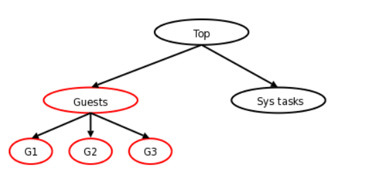
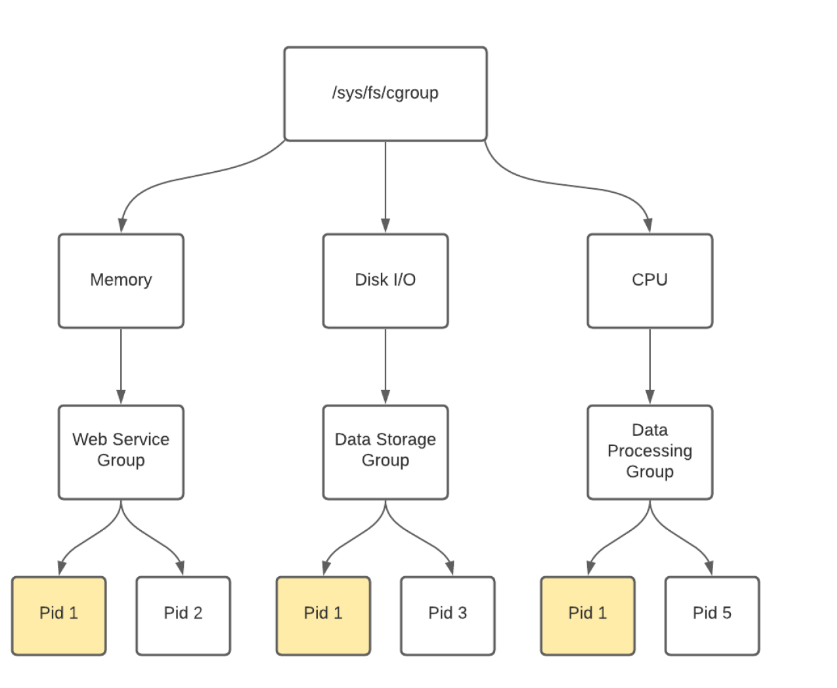

### Process Container
从现在看来，`cgroups`就是容器技术的基石，但是在2007年时，内核引入的container技术就是cgroups的雏形。
process container引入了一些新的概念：
* subsystem: 绑定一组进程正在使用的资源的一种机制，例如`cpuset`就成了一个`subsystem`，`subsystem`多用于资源管理。
* contaniner：一组共享相同配置的`subsystem`的进程，以`cpuset`为例，一个container可以绑定一组processors，在该container内的所有进程都继承相同的配置（有权使用相同的一组processors）。其他类似的`subsystem`可以通过container实现限制`cpu time`、`IO`、`memory usage`、`filesystem`等使用。

重要的一点，container是可以分层的，意味着一个container可以包含另一个container。

以上图为例，一个主机可以通过两个container完成对主机CPU time使用的控制。
因为主机需要预留一下管理操作空间，不能让`Guest`占用了所有的CPU，可以通过配置`Guests` container，允许使用最多`90%`的CPU，Sys tasks预留10%的CPU.
这样无论何时，主机正常的管理操作cpu得到了保证。

容器的分层结构有一些基础规则
* 每一层级都有一个或多个subsystem（控制一个或多个subsystem的配置）
* 一个subsystem只能关联到一个层级（一个subsystem配置只能允许一个层级控制）
* 如果有不止一个层级，那系统中的每一个进程都处于多个容器中（每一层级就相当于一个独立的容器）

`container`在设计之初就是通过文件系统的方式管理的，通过`mount`挂载的方式实现`subsystem`层级的配置。
每个`container`下有一个文件`tasks`，里面目前在该container里的所有进程的PID，将某进程到添加到某个容器中去，可以简单的通过将其PID写入对应的`[container]/tasks`文件中


### CGroup
原本的`Process Container`，由于`container`的不同含义，避免乱用，重命名为`Cgroup`（Control Group）。
到目前为止cgroup有两个大版本: V1和V2。

#### subsystem
cgroup下有多个子系统，其中大多数是可以称为是*资源控制器*，但是也有部分子系统是其他用途。
##### Idetify
控制的前提是识别，cgroup下的net_cl/net_prio两个子系统的作用就是唯一标识每一个cgroup。
* net_cl/net_prio
  
  这两个子系统负责标识不同的`cgroup`（将每一个cgroup和一个小数关联），并且会被复制到由对应cgroup下进程创建的socket中。
`net_prio.prioidx`保存着cgroup core分配给每一个cgroup的标识（每一个cgroup唯一），`net_cls.classid`是
显示地给每一个cgroup的标识，不限于每一个cgroup唯一。
现在这两个子系统本质上是合并了，在cgroup目录下，都指向`net_cls,net_prio`
    ```shell
        tree@tree-pc:$ ll /sys/fs/cgroup/ | grep net
    lrwxrwxrwx  1 root root  16 7月  19 07:41 net_cls -> net_cls,net_prio/
    dr-xr-xr-x  2 root root   0 7月  19 07:41 net_cls,net_prio/
    lrwxrwxrwx  1 root root  16 7月  19 07:41 net_prio -> net_cls,net_prio/
    ```
##### Hierarchy
cgroup的另一个重要特点就是可分层级，下面的三个子系统都使用了cgroup的分层特点，而在如何控制cgroup的配置流向到具体的每一个进程过程有些不同
* devices
  
  devices子系统可以为设备文件设置访问控制策略，每一个group可以默认允许/拒绝所有访问，然后再通过一个例外列表设定允许/决绝访问，分别在文件`devices.allow\devices.deny\devices.list`中

  更新这个例外列表的代码通过拒绝父group不允许的更改或者将更改传递给子group，保证子group不会拥有超过父group的权限；这意味着当需要执行权限校验时，只需要检查group的默认规则和例外列表，没必要遍历整个树结构，因为父节点的规则已经传递给其下的子节点。
  
  这其实是一种取舍策略，更新每一个group的权限的逻辑更复杂，换取的是在校验权限时更简单。因为后者比前者更频繁，所以这个取舍是合算的。

  device子系统充当这种取舍范围的中点。每一个cgroup的配置都会向下传递到所有的子节点，一直到叶子节点才不再传递，每一个进程在做访问权限的决策时需要返回对应的cgroup。
  
* freezer
  
  freezer子系统有着完全不同的需求。每一个cgroup下的`freezer.stat`文件可以被写入`FORZEN/THAWED`，作用就相当于向一组进程发送`SIGSTOP/SIGCONT`信号。
  为了直接管理到进程，freezer子系统在遍历cgroup的层级结构时，多走了一步，需要具体到属于cgroup下的进程。

* perf_event
  
  perf工具用于收集一组进程（也可以是系统上的所有进程）的性能数据，可以从多个维度去指定一组进程：
  * 某一用户创建
  * 某一个父进程的后代
  * 或者使用`perf_event` cgroup子系统，指某些cgroup下的一组进程。

##### resource control

除上述subsystem，cgroup下的其他subsystem多是用于资源管理，其中最先出现的就是`cpuset`
```shell
-rw-r--r--  1 root root   0 7月  23 09:08 cpuset.cpu_exclusive
-rw-r--r--  1 root root   0 7月  23 09:08 cpuset.cpus
-r--r--r--  1 root root   0 7月  23 09:08 cpuset.effective_cpus
-r--r--r--  1 root root   0 7月  23 09:08 cpuset.effective_mems
-rw-r--r--  1 root root   0 7月  23 09:08 cpuset.mem_exclusive
-rw-r--r--  1 root root   0 7月  23 09:08 cpuset.mem_hardwall
-rw-r--r--  1 root root   0 7月  23 09:08 cpuset.memory_migrate
-r--r--r--  1 root root   0 7月  23 09:08 cpuset.memory_pressure
-rw-r--r--  1 root root   0 7月  23 09:08 cpuset.memory_pressure_enabled
-rw-r--r--  1 root root   0 7月  23 09:08 cpuset.memory_spread_page
-rw-r--r--  1 root root   0 7月  23 09:08 cpuset.memory_spread_slab
-rw-r--r--  1 root root   0 7月  23 09:08 cpuset.mems
-rw-r--r--  1 root root   0 7月  23 09:08 cpuset.sched_load_balance
-rw-r--r--  1 root root   0 7月  23 09:08 cpuset.sched_relax_domain_level
```
`cpuset`不仅限定了当前cgroup下进程可用cpu，也包括内存的使用限制。


##### Prioritization
优先级相当于一种间接地资源限制，并不明确地限制某进程能够使用的资源，而是指定进程A总是有高于进程B的系统占用时间（时间片）。

#### Summary

#### Security
在cgroups出现的安全问题基本围绕两点

* devices
  
  `devices.allow`决定了`task`下所有进程能够访问到的设备，在隔离的环境下，如果该文件被重写使得容器内的进程能够访问到整个主机磁盘设备的话，就可以通过新建设备文件然后重新挂载/`debugfs`的方式进行磁盘读写造成逃逸。
  其中`devices.allow`的格式是`type major:mahor access`，写入`a *:* rwm`即可造成访问其他设备。
* release_agent
  
  `release_agent`属于`cgroup`的清理机制，当`notify_on_release`为1，如果该cgroup下不再有存活进程，就会触发释放整个cgroup。底层的实际是在内核中调用了`call_usermodhelper`（内核态执行用户态的程序，权限高），当`release_agent/notify_on_release`可以随意更改时很容易造成滥用。
### 参考
[Process Containers](https://lwn.net/Articles/236038/)
[A Linux sysadmin's introduction to cgroups](https://www.redhat.com/sysadmin/cgroups-part-one)
[Control groups, part 1: On the history of process grouping](https://lwn.net/Articles/603762/)
[Control groups, part 2: On the different sorts of hierarchies](https://lwn.net/Articles/604413/)
[Control groups, part 3: First steps to control](https://lwn.net/Articles/605039/)
[Control groups, part 4: On accounting](https://lwn.net/Articles/606004/)
[Control groups, part 5: The cgroup hierarchy](https://lwn.net/Articles/606699/)
[Control groups, part 6: A look under the hood](https://lwn.net/Articles/606925/)
[Control groups, part 7: To unity and beyond](https://lwn.net/Articles/608425/)