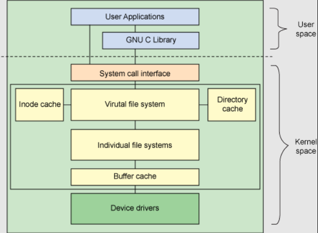
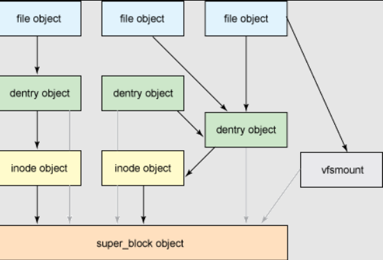
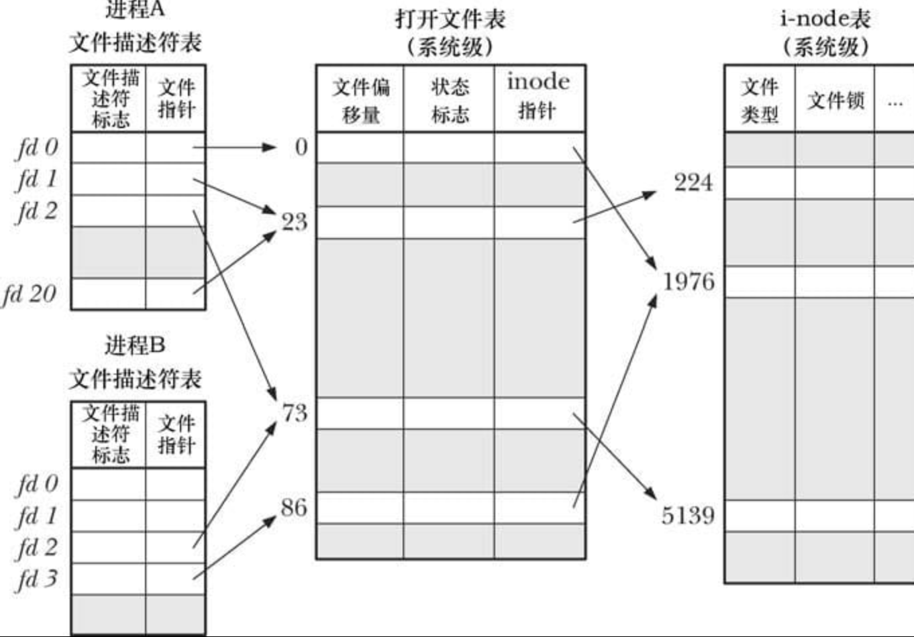

### 前言
在Linux操作系统上可能最常用的一些api就是`read/write`/`printf`等I/O函数，了解它们底层的逻辑对了解整个文件系统的运作方式是很有帮助，也能快速定位一些I/O问题。

### Architecture
文件操作系统主体属于Linux内核的一部分，只是向用户态提供了可以使用的接口，整个架构如下图


用户态可以通过`GNU C Library`（本质是最终调用了system call）访问文件系统，VFS是底层文件系统的主要接口，它是一种文件系统的抽象类，定义了一组文件系统通用的接口，具体的每一个类型的文件系统在实例化该类的时候可以定义每一个接口（兼容多种文件系统类型的原因），例如`ext2`


在VFS中，有几个重要的结构：superblock、inode、dentry、File
由这四种数据结构构成了**通用文件模型**

这四个结构之间的关系


#### Superblock
`superblock`标识一个已挂载的文件系统。
`superblock`保存了有关文件系统的元数据信息，通常位于磁盘的特定扇区，在挂在文件系统时，超级块的内容被读取，并在内存中建立super_block结构，便于kernel管理对应的文件系统。
相关代码在`linux/fs.h`
```c
struct super_block {
	struct list_head	s_list;		/* Keep this first */
	dev_t			s_dev;		/* search index; _not_ kdev_t */
	unsigned char		s_blocksize_bits;
	unsigned long		s_blocksize;
	loff_t			s_maxbytes;	/* Max file size */
	struct file_system_type	*s_type;
	const struct super_operations	*s_op;
	const struct dquot_operations	*dq_op;
	const struct quotactl_ops	*s_qcop;
	const struct export_operations *s_export_op;
	unsigned long		s_flags;
	unsigned long		s_iflags;	/* internal SB_I_* flags */
	unsigned long		s_magic;
	struct dentry		*s_root;
	struct rw_semaphore	s_umount;
	int			s_count;
	atomic_t		s_active;
#ifdef CONFIG_SECURITY
	void                    *s_security;
#endif
	const struct xattr_handler **s_xattr;
#ifdef CONFIG_FS_ENCRYPTION
	const struct fscrypt_operations	*s_cop;
	struct key		*s_master_keys; /* master crypto keys in use */
#endif
#ifdef CONFIG_FS_VERITY
	const struct fsverity_operations *s_vop;
#endif
#if IS_ENABLED(CONFIG_UNICODE)
	struct unicode_map *s_encoding;
	__u16 s_encoding_flags;
#endif
	struct hlist_bl_head	s_roots;	/* alternate root dentries for NFS */
	struct list_head	s_mounts;	/* list of mounts; _not_ for fs use */
	struct block_device	*s_bdev;
	struct backing_dev_info *s_bdi;
	struct mtd_info		*s_mtd;
	struct hlist_node	s_instances;
	unsigned int		s_quota_types;	/* Bitmask of supported quota types */
	struct quota_info	s_dquot;	/* Diskquota specific options */

	struct sb_writers	s_writers;

	/*
	 * Keep s_fs_info, s_time_gran, s_fsnotify_mask, and
	 * s_fsnotify_marks together for cache efficiency. They are frequently
	 * accessed and rarely modified.
	 */
	void			*s_fs_info;	/* Filesystem private info */

	/* Granularity of c/m/atime in ns (cannot be worse than a second) */
	u32			s_time_gran;
	/* Time limits for c/m/atime in seconds */
	time64_t		   s_time_min;
	time64_t		   s_time_max;
#ifdef CONFIG_FSNOTIFY
	__u32			s_fsnotify_mask;
	struct fsnotify_mark_connector __rcu	*s_fsnotify_marks;
#endif

	char			s_id[32];	/* Informational name */
	uuid_t			s_uuid;		/* UUID */

	unsigned int		s_max_links;
	fmode_t			s_mode;

	/*
	 * The next field is for VFS *only*. No filesystems have any business
	 * even looking at it. You had been warned.
	 */
	struct mutex s_vfs_rename_mutex;	/* Kludge */

	/*
	 * Filesystem subtype.  If non-empty the filesystem type field
	 * in /proc/mounts will be "type.subtype"
	 */
	const char *s_subtype;

	const struct dentry_operations *s_d_op; /* default d_op for dentries */

	struct shrinker s_shrink;	/* per-sb shrinker handle */

	/* Number of inodes with nlink == 0 but still referenced */
	atomic_long_t s_remove_count;

	/*
	 * Number of inode/mount/sb objects that are being watched, note that
	 * inodes objects are currently double-accounted.
	 */
	atomic_long_t s_fsnotify_connectors;

	/* Being remounted read-only */
	int s_readonly_remount;

	/* per-sb errseq_t for reporting writeback errors via syncfs */
	errseq_t s_wb_err;

	/* AIO completions deferred from interrupt context */
	struct workqueue_struct *s_dio_done_wq;
	struct hlist_head s_pins;

	/*
	 * Owning user namespace and default context in which to
	 * interpret filesystem uids, gids, quotas, device nodes,
	 * xattrs and security labels.
	 */
	struct user_namespace *s_user_ns;

	/*
	 * The list_lru structure is essentially just a pointer to a table
	 * of per-node lru lists, each of which has its own spinlock.
	 * There is no need to put them into separate cachelines.
	 */
	struct list_lru		s_dentry_lru;
	struct list_lru		s_inode_lru;
	struct rcu_head		rcu;
	struct work_struct	destroy_work;

	struct mutex		s_sync_lock;	/* sync serialisation lock */

	/*
	 * Indicates how deep in a filesystem stack this SB is
	 */
	int s_stack_depth;

	/* s_inode_list_lock protects s_inodes */
	spinlock_t		s_inode_list_lock ____cacheline_aligned_in_smp;
	struct list_head	s_inodes;	/* all inodes */

	spinlock_t		s_inode_wblist_lock;
	struct list_head	s_inodes_wb;	/* writeback inodes */
} __randomize_layout;

```
成员比较多，大致可以分为三类：
* 设备的元数据
* 文件系统的元数据
* 超级块的操作函数

VFS里的V的体现主要实现在于操作函数，超级块的操作函数在一个单独的结构体中
```c
	const struct super_operations	*s_op;
```
`super_operations`结构包含了超级块的各种操作函数，但是并没有具体的实现，而是一堆函数指针，不同的文件系统在注册时可以定义独有的函数。
```c
struct super_operations {
   	struct inode *(*alloc_inode)(struct super_block *sb);
	void (*destroy_inode)(struct inode *);
	void (*free_inode)(struct inode *);

   	void (*dirty_inode) (struct inode *, int flags);
	int (*write_inode) (struct inode *, struct writeback_control *wbc);
	int (*drop_inode) (struct inode *);
	void (*evict_inode) (struct inode *);
	void (*put_super) (struct super_block *);
	int (*sync_fs)(struct super_block *sb, int wait);
	int (*freeze_super) (struct super_block *);
	int (*freeze_fs) (struct super_block *);
	int (*thaw_super) (struct super_block *);
	int (*unfreeze_fs) (struct super_block *);
	int (*statfs) (struct dentry *, struct kstatfs *);
	int (*remount_fs) (struct super_block *, int *, char *);
	void (*umount_begin) (struct super_block *);

	int (*show_options)(struct seq_file *, struct dentry *);
	int (*show_devname)(struct seq_file *, struct dentry *);
	int (*show_path)(struct seq_file *, struct dentry *);
	int (*show_stats)(struct seq_file *, struct dentry *);
#ifdef CONFIG_QUOTA
	ssize_t (*quota_read)(struct super_block *, int, char *, size_t, loff_t);
	ssize_t (*quota_write)(struct super_block *, int, const char *, size_t, loff_t);
	struct dquot **(*get_dquots)(struct inode *);
#endif
	long (*nr_cached_objects)(struct super_block *,
				  struct shrink_control *);
	long (*free_cached_objects)(struct super_block *,
				    struct shrink_control *);
};
```
#### Index Of node  (inode)
VFS将文件系统中的文件、目录、符号链接等对象都用`inode`表示（我认为这大概就是所谓的一切皆文件的原因吧）
相关结构定义在`linux/fs.h`中
```c
/*
 * Keep mostly read-only and often accessed (especially for
 * the RCU path lookup and 'stat' data) fields at the beginning
 * of the 'struct inode'
 */
struct inode {
	umode_t			i_mode;
	unsigned short		i_opflags;
	kuid_t			i_uid;
	kgid_t			i_gid;
	unsigned int		i_flags;

#ifdef CONFIG_FS_POSIX_ACL
	struct posix_acl	*i_acl;
	struct posix_acl	*i_default_acl;
#endif

	const struct inode_operations	*i_op;
	struct super_block	*i_sb;
	struct address_space	*i_mapping;

#ifdef CONFIG_SECURITY
	void			*i_security;
#endif

	/* Stat data, not accessed from path walking */
	unsigned long		i_ino;
	/*
	 * Filesystems may only read i_nlink directly.  They shall use the
	 * following functions for modification:
	 *
	 *    (set|clear|inc|drop)_nlink
	 *    inode_(inc|dec)_link_count
	 */
	union {
		const unsigned int i_nlink;
		unsigned int __i_nlink;
	};
	dev_t			i_rdev;
	loff_t			i_size;
	struct timespec64	i_atime;
	struct timespec64	i_mtime;
	struct timespec64	i_ctime;
	spinlock_t		i_lock;	/* i_blocks, i_bytes, maybe i_size */
	unsigned short          i_bytes;
	u8			i_blkbits;
	u8			i_write_hint;
	blkcnt_t		i_blocks;

#ifdef __NEED_I_SIZE_ORDERED
	seqcount_t		i_size_seqcount;
#endif

	/* Misc */
	unsigned long		i_state;
	struct rw_semaphore	i_rwsem;

	unsigned long		dirtied_when;	/* jiffies of first dirtying */
	unsigned long		dirtied_time_when;

	struct hlist_node	i_hash;
	struct list_head	i_io_list;	/* backing dev IO list */
#ifdef CONFIG_CGROUP_WRITEBACK
	struct bdi_writeback	*i_wb;		/* the associated cgroup wb */

	/* foreign inode detection, see wbc_detach_inode() */
	int			i_wb_frn_winner;
	u16			i_wb_frn_avg_time;
	u16			i_wb_frn_history;
#endif
	struct list_head	i_lru;		/* inode LRU list */
	struct list_head	i_sb_list;
	struct list_head	i_wb_list;	/* backing dev writeback list */
	union {
		struct hlist_head	i_dentry;
		struct rcu_head		i_rcu;
	};
	atomic64_t		i_version;
	atomic64_t		i_sequence; /* see futex */
	atomic_t		i_count;
	atomic_t		i_dio_count;
	atomic_t		i_writecount;
#if defined(CONFIG_IMA) || defined(CONFIG_FILE_LOCKING)
	atomic_t		i_readcount; /* struct files open RO */
#endif
	union {
		const struct file_operations	*i_fop;	/* former ->i_op->default_file_ops */
		void (*free_inode)(struct inode *);
	};
	struct file_lock_context	*i_flctx;
	struct address_space	i_data;
	struct list_head	i_devices;
	union {
		struct pipe_inode_info	*i_pipe;
		struct cdev		*i_cdev;
		char			*i_link;
		unsigned		i_dir_seq;
	};

	__u32			i_generation;

#ifdef CONFIG_FSNOTIFY
	__u32			i_fsnotify_mask; /* all events this inode cares about */
	struct fsnotify_mark_connector __rcu	*i_fsnotify_marks;
#endif

#ifdef CONFIG_FS_ENCRYPTION
	struct fscrypt_info	*i_crypt_info;
#endif

#ifdef CONFIG_FS_VERITY
	struct fsverity_info	*i_verity_info;
#endif

	void			*i_private; /* fs or device private pointer */
} __randomize_layout;
```
该结构定义了关于该对象（文件/目录）的元数据和操作函数
元数据包括：
* 时间戳：包括access time/modify time/create time.
```c
	struct timespec64	i_atime;
	struct timespec64	i_mtime;
	struct timespec64	i_ctime;
```
* 文件属者和权限
```c
	umode_t			i_mode;
	kuid_t			i_uid;
	kgid_t			i_gid;
```
* 该inode所属的超级块
```c
	struct super_block	*i_sb;
```
`inode`的操作函数定义在`inode_operations`结构中
```c
struct inode_operations {
	struct dentry * (*lookup) (struct inode *,struct dentry *, unsigned int);
	const char * (*get_link) (struct dentry *, struct inode *, struct delayed_call *);
	int (*permission) (struct user_namespace *, struct inode *, int);
	struct posix_acl * (*get_acl)(struct inode *, int, bool);

	int (*readlink) (struct dentry *, char __user *,int);

	int (*create) (struct user_namespace *, struct inode *,struct dentry *,
		       umode_t, bool);
	int (*link) (struct dentry *,struct inode *,struct dentry *);
	int (*unlink) (struct inode *,struct dentry *);
	int (*symlink) (struct user_namespace *, struct inode *,struct dentry *,
			const char *);
	int (*mkdir) (struct user_namespace *, struct inode *,struct dentry *,
		      umode_t);
	int (*rmdir) (struct inode *,struct dentry *);
	int (*mknod) (struct user_namespace *, struct inode *,struct dentry *,
		      umode_t,dev_t);
	int (*rename) (struct user_namespace *, struct inode *, struct dentry *,
			struct inode *, struct dentry *, unsigned int);
	int (*setattr) (struct user_namespace *, struct dentry *,
			struct iattr *);
	int (*getattr) (struct user_namespace *, const struct path *,
			struct kstat *, u32, unsigned int);
	ssize_t (*listxattr) (struct dentry *, char *, size_t);
	int (*fiemap)(struct inode *, struct fiemap_extent_info *, u64 start,
		      u64 len);
	int (*update_time)(struct inode *, struct timespec64 *, int);
	int (*atomic_open)(struct inode *, struct dentry *,
			   struct file *, unsigned open_flag,
			   umode_t create_mode);
	int (*tmpfile) (struct user_namespace *, struct inode *,
			struct dentry *, umode_t);
	int (*set_acl)(struct user_namespace *, struct inode *,
		       struct posix_acl *, int);
	int (*fileattr_set)(struct user_namespace *mnt_userns,
			    struct dentry *dentry, struct fileattr *fa);
	int (*fileattr_get)(struct dentry *dentry, struct fileattr *fa);
} ____cacheline_aligned;
```
inode相关的函数操作包括：
* 文件/目录的创建、删除
* 软硬链接的管理
* 权限相关管理
* 文件属性管理


#### dentry 目录项
`dentry`结构用于将`inode`（文件）和目录项（文件路径）关联起来。例如文件`/home/tree/file`路径中，创建了四个目录项：`/`、`home`、`tree`、`file`。
换言之，文件系统的层级结构是由`dentry`实现的，整个文件系统中只有一个`根dentry`是没有父节点的，根节点在超级块中指定：`super_block.s_root`。
其余的`dentry`都有父节点，甚至子节点（有子节点是目录，叶子节点是文件）。
目录项结构定义在`fs/dcache.h`中
```c
struct dentry {
	/* RCU lookup touched fields */
	unsigned int d_flags;		/* protected by d_lock */
	seqcount_spinlock_t d_seq;	/* per dentry seqlock */
	struct hlist_bl_node d_hash;	/* lookup hash list */
	struct dentry *d_parent;	/* parent directory */
	struct qstr d_name;
	struct inode *d_inode;		/* Where the name belongs to - NULL is
					 * negative */
	unsigned char d_iname[DNAME_INLINE_LEN];	/* small names */

	/* Ref lookup also touches following */
	struct lockref d_lockref;	/* per-dentry lock and refcount */
	const struct dentry_operations *d_op;
	struct super_block *d_sb;	/* The root of the dentry tree */
	unsigned long d_time;		/* used by d_revalidate */
	void *d_fsdata;			/* fs-specific data */

	union {
		struct list_head d_lru;		/* LRU list */
		wait_queue_head_t *d_wait;	/* in-lookup ones only */
	};
	struct list_head d_child;	/* child of parent list */
	struct list_head d_subdirs;	/* our children */
	/*
	 * d_alias and d_rcu can share memory
	 */
	union {
		struct hlist_node d_alias;	/* inode alias list */
		struct hlist_bl_node d_in_lookup_hash;	/* only for in-lookup ones */
	 	struct rcu_head d_rcu;
	} d_u;
} __randomize_layout;
```
相比较前面的结构，dentry的比较简单，由于dentry只是出现在内存缓存中，不需要磁盘相关的属性。
目录项的缓存可以通过`/proc/slabinfo`查看：
```shell
 name            <active_objs> <num_objs> <objsize> <objperslab> <pagesperslab> : tunables <limit> <batchcount> <sharedfactor> : slabdata <active_slabs> <num_slabs> <sharedavail>
 dentry            160268 160272    192   21    1 : tunables    0    0    0 : slabdata   7632   7632      0
```
由于super_block中保留着整个文件系统的根目录，每一个dentry中都有一个字段指向super_block
```c
struct super_block *d_sb;
```
目录项的操作函数结构是针对缓存的，包括判断是否有效、释放缓存等
```c
struct dentry_operations {
	int (*d_revalidate)(struct dentry *, unsigned int);
	int (*d_weak_revalidate)(struct dentry *, unsigned int);
	int (*d_hash)(const struct dentry *, struct qstr *);
	int (*d_compare)(const struct dentry *,
			unsigned int, const char *, const struct qstr *);
	int (*d_delete)(const struct dentry *);
	int (*d_init)(struct dentry *);
	void (*d_release)(struct dentry *);
	void (*d_prune)(struct dentry *);
	void (*d_iput)(struct dentry *, struct inode *);
	char *(*d_dname)(struct dentry *, char *, int);
	struct vfsmount *(*d_automount)(struct path *);
	int (*d_manage)(const struct path *, bool);
	struct dentry *(*d_real)(struct dentry *, const struct inode *);
} ____cacheline_aligned;
```

#### File   文件
file结构用于表示进程打开的文件，在open系统调用时创建，在close时释放。
所有的文件操作围绕这个结构展开的
```c
struct file {
	union {
		struct llist_node	fu_llist;
		struct rcu_head 	fu_rcuhead;
	} f_u;
	struct path		f_path;             // 同时包含 dentry & vfsmount
	struct inode		*f_inode;	/* cached value */
	const struct file_operations	*f_op;  // 文件操作结构

	/*
	 * Protects f_ep, f_flags.
	 * Must not be taken from IRQ context.
	 */
	spinlock_t		f_lock;
	atomic_long_t		f_count;        // file结构的引用计数，为0时，释放该结构
	unsigned int 		f_flags;
	fmode_t			f_mode;
	struct mutex		f_pos_lock;
	loff_t			f_pos;
	struct fown_struct	f_owner;
	const struct cred	*f_cred;
	struct file_ra_state	f_ra;

	u64			f_version;
#ifdef CONFIG_SECURITY
	void			*f_security;
#endif
	/* needed for tty driver, and maybe others */
	void			*private_data;

#ifdef CONFIG_EPOLL
	/* Used by fs/eventpoll.c to link all the hooks to this file */
	struct hlist_head	*f_ep;
#endif /* #ifdef CONFIG_EPOLL */
	struct address_space	*f_mapping;
	errseq_t		f_wb_err;
	errseq_t		f_sb_err; /* for syncfs */
} __randomize_layout
```
文件的操作结构成员定义和系统调用/库函数基本保持一致
```c
struct file_operations {
	struct module *owner;
	loff_t (*llseek) (struct file *, loff_t, int);
	ssize_t (*read) (struct file *, char __user *, size_t, loff_t *);
	ssize_t (*write) (struct file *, const char __user *, size_t, loff_t *);
	ssize_t (*read_iter) (struct kiocb *, struct iov_iter *);
	ssize_t (*write_iter) (struct kiocb *, struct iov_iter *);
	int (*iopoll)(struct kiocb *kiocb, struct io_comp_batch *,
			unsigned int flags);
	int (*iterate) (struct file *, struct dir_context *);
	int (*iterate_shared) (struct file *, struct dir_context *);
	__poll_t (*poll) (struct file *, struct poll_table_struct *);
	long (*unlocked_ioctl) (struct file *, unsigned int, unsigned long);
	long (*compat_ioctl) (struct file *, unsigned int, unsigned long);
	int (*mmap) (struct file *, struct vm_area_struct *);
	unsigned long mmap_supported_flags;
	int (*open) (struct inode *, struct file *);
	int (*flush) (struct file *, fl_owner_t id);
	int (*release) (struct inode *, struct file *);
	int (*fsync) (struct file *, loff_t, loff_t, int datasync);
	int (*fasync) (int, struct file *, int);
	int (*lock) (struct file *, int, struct file_lock *);
	ssize_t (*sendpage) (struct file *, struct page *, int, size_t, loff_t *, int);
	unsigned long (*get_unmapped_area)(struct file *, unsigned long, unsigned long, unsigned long, unsigned long);
	int (*check_flags)(int);
	int (*flock) (struct file *, int, struct file_lock *);
	ssize_t (*splice_write)(struct pipe_inode_info *, struct file *, loff_t *, size_t, unsigned int);
	ssize_t (*splice_read)(struct file *, loff_t *, struct pipe_inode_info *, size_t, unsigned int);
	int (*setlease)(struct file *, long, struct file_lock **, void **);
	long (*fallocate)(struct file *file, int mode, loff_t offset,
			  loff_t len);
	void (*show_fdinfo)(struct seq_file *m, struct file *f);
#ifndef CONFIG_MMU
	unsigned (*mmap_capabilities)(struct file *);
#endif
	ssize_t (*copy_file_range)(struct file *, loff_t, struct file *,
			loff_t, size_t, unsigned int);
	loff_t (*remap_file_range)(struct file *file_in, loff_t pos_in,
				   struct file *file_out, loff_t pos_out,
				   loff_t len, unsigned int remap_flags);
	int (*fadvise)(struct file *, loff_t, loff_t, int);
} __randomize_layout;

```

#### File Descriptor
进程在通过系统调用/库函数 `open` 一个文件时，会得到一个文件描述符`fd`。每个进程会维护自己的*一组已经打开的文件*
文件描述符和前面的File文件结构不同在于：前者是进程级（每个进程独有），后者是系统级（系统维护的所有被打开的文件）
文件描述符结构`files_struct`定义在`fs/fdtable.h`中
```c
/*
 * Open file table structure
 */
struct files_struct {
  /*
   * read mostly part
   */
	atomic_t count;
	bool resize_in_progress;
	wait_queue_head_t resize_wait;

	struct fdtable __rcu *fdt;
	struct fdtable fdtab;
  /*
   * written part on a separate cache line in SMP
   */
	spinlock_t file_lock ____cacheline_aligned_in_smp;
	unsigned int next_fd;
	unsigned long close_on_exec_init[1];
	unsigned long open_fds_init[1];
	unsigned long full_fds_bits_init[1];
	struct file __rcu * fd_array[NR_OPEN_DEFAULT];
};

struct fdtable {
	unsigned int max_fds;
	struct file __rcu **fd;      /* current fd array */
	unsigned long *close_on_exec;
	unsigned long *open_fds;
	unsigned long *full_fds_bits;
	struct rcu_head rcu;
};
```
该结构中包含一个`struct fdtable实例`和一个`struct fdtable指针`，
同时`fdtable`中的成员`close_on_exec`、`open_fds`、`full_fds_bits`、`fd`分别指向`files_struct`的成员`
close_on_exec_init\open_fds_init\full_fds_bits_init\fd_array`。

`struct files_struct`和`struct file`的关系


#### Relationships 各结构之间的关系
从文件描述符到super_block，通过理清上述各种结构之间的关系，可以对用户态进程文件操作的背后文件系统逻辑有一个全局的认知。基本的流程如下图

### 参考
[l-linux-filesystem](https://developer.ibm.com/tutorials/l-linux-filesystem/)

[l-virtual-filesystem-switch](https://developer.ibm.com/tutorials/l-virtual-filesystem-switch)

