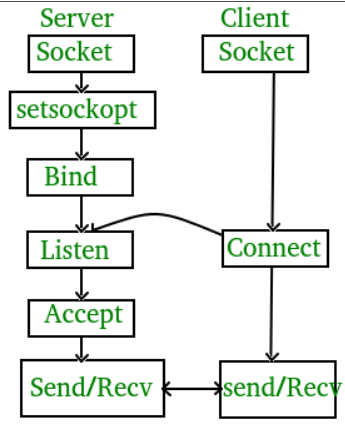

#### 简介
tcp真正建立连接是从connect开始的
整个tcp server和client的工作流程从syscall的角度看来如下


在之前的内容中描述了server端的socket/bind/listen细节，这里将根据上述工作图流程看下client端的connect细节


#### Internal
connect的实现比较简单
```c
int __sys_connect(int fd, struct sockaddr __user *uservaddr, int addrlen)
{
	int ret = -EBADF;
	struct fd f;

	f = fdget(fd);
	if (f.file) {
		struct sockaddr_storage address;

		ret = move_addr_to_kernel(uservaddr, addrlen, &address);
		if (!ret)
			ret = __sys_connect_file(f.file, &address, addrlen, 0);
		fdput(f);
	}

	return ret;
}

```
* 根据fd找到对应的`struct fd`、`struct file`结构
  * 这里的`struct fd`是client调用`socket`创建的
* move_addr_to_kernel拷贝数据到内核中
* 调用__sys_connect_file
```c
int __sys_connect_file(struct file *file, struct sockaddr_storage *address,
		       int addrlen, int file_flags)
{
	struct socket *sock;
	int err;

	sock = sock_from_file(file);
	if (!sock) {
		err = -ENOTSOCK;
		goto out;
	}

	err =
	    security_socket_connect(sock, (struct sockaddr *)address, addrlen);
	if (err)
		goto out;

	err = sock->ops->connect(sock, (struct sockaddr *)address, addrlen,
				 sock->file->f_flags | file_flags);
out:
	return err;
}
```
* 根据`struct file`结构获取`struct socket`实例（private_data字段）
* 调用`sock->ops->connect`即`inet_stream_connect`

```c
int __inet_stream_connect(struct socket *sock, struct sockaddr *uaddr,
			  int addr_len, int flags, int is_sendmsg)
{
	struct sock *sk = sock->sk;
	int err;
	long timeo;
    ...
    switch (sock->state) {
        default:
            err = -EINVAL;
            goto out;
        case SS_CONNECTED:
            err = -EISCONN;
            goto out;
        case SS_CONNECTING:
            if (inet_sk(sk)->defer_connect)
                err = is_sendmsg ? -EINPROGRESS : -EISCONN;
            else
                err = -EALREADY;
            /* Fall out of switch with err, set for this state */
            break;
        case SS_UNCONNECTED:
            err = -EISCONN;
            if (sk->sk_state != TCP_CLOSE)
                goto out;

            if (BPF_CGROUP_PRE_CONNECT_ENABLED(sk)) {
                err = sk->sk_prot->pre_connect(sk, uaddr, addr_len);
                if (err)
                    goto out;
            }

            err = sk->sk_prot->connect(sk, uaddr, addr_len);
            if (err < 0)
                goto out;

            sock->state = SS_CONNECTING;

            if (!err && inet_sk(sk)->defer_connect)
                goto out;

            /* Just entered SS_CONNECTING state; the only
            * difference is that return value in non-blocking
            * case is EINPROGRESS, rather than EALREADY.
            */
            err = -EINPROGRESS;
            break;
        }
	timeo = sock_sndtimeo(sk, flags & O_NONBLOCK);

	if ((1 << sk->sk_state) & (TCPF_SYN_SENT | TCPF_SYN_RECV)) {
		int writebias = (sk->sk_protocol == IPPROTO_TCP) &&
				tcp_sk(sk)->fastopen_req &&
				tcp_sk(sk)->fastopen_req->data ? 1 : 0;

		/* Error code is set above */
		if (!timeo || !inet_wait_for_connect(sk, timeo, writebias))
			goto out;

		err = sock_intr_errno(timeo);
		if (signal_pending(current))
			goto out;
	}
}

```
* 根据当前socket的状态不同处理，我们只关心默认的`SS_UNCONNECTED`未连接状态，其他状态多是竞争导致的，会返回不同的报错信息
* 对于`SS_UNCONNECTED`，会检查`sk->sk_state`是否为`TCP_CLOSE`（client创建的socket默认状态）
* 调用sk->sk_prot->connect即`tcp_v4_connect`
该方法向指定的server发SYN请求，并将client的sock状态设置为`TCP_SYN_SENT`
* 设置socket状态为`SS_CONNECTING`
* 设置err为`-EINPROGRESS`

* 根据flags是否设置为`O_NONBLOCK`【非阻塞】，来设置timeo的值
  * 如果设置了，timeo=0
  * 如果没有设置，timeo为`sk->sk_sndtimeo`即连接超时时间
* 如果timeo为0，直接返回当前err给用户（`-EINPROGRESS`）
* 如果timeo不为0，`inet_wait_for_connect`等待连接完成，超时时间timeo
接下来可以详细看下`tcp_v4_connect`
```c
/* This will initiate an outgoing connection. */
int tcp_v4_connect(struct sock *sk, struct sockaddr *uaddr, int addr_len)
{
    ...
	tcp_set_state(sk, TCP_SYN_SENT);
	err = inet_hash_connect(tcp_death_row, sk);
	if (err)
		goto failure;

	sk_set_txhash(sk);
    ...
    err = tcp_connect(sk);
    ...
}
```
* 修改sk->sk_state为`TCP_SYN_SENT`
* `inet_hash_connect`为当前socket绑定一个端口，并将其添加到哈希表
* `tcp_connect`构造并发送SYN消息


